> Continuous integration is a DevOps buzzword, which indicates the practice of continually
merging source code updates from developers, conducting tests and building artifacts upon
the shared mainline. Disasters used to happen during a code merge when a developer works
in isolation and drifts too far from the work of others. CI offers a fail-fast mitigation by
automating the tasks of constantly building and testing the integrated artifact, which saves Ops team
from human efforts beyond imagination. This article will focus on a demo solution
of setting up private CI environment.

## Tech Overview

There are various software components of choice to build up a CI environment, the diagram below shows 2 possible
solutions under one workflow.

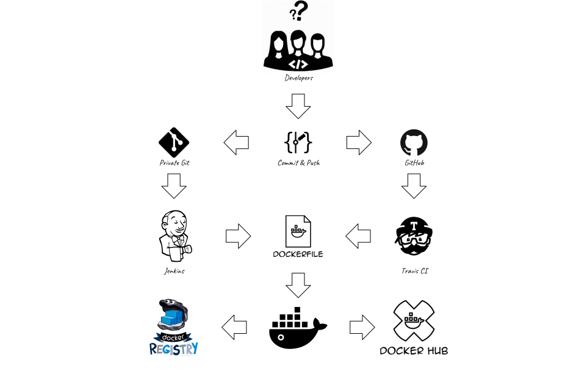

### Workflow

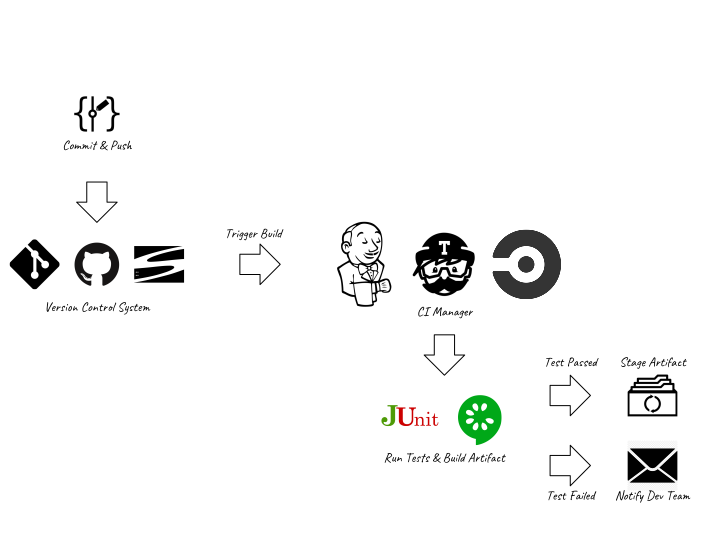

- Developers push code to version control system (Git or Github)
- Version control system notifies CI manager (Jenkins or Travis) about the update
- CI manager pulls the latest code, conducts unit test and builds artifact
- If all tests are passed, the artifact will be staged for deployment, if not, dev team will be notified by email.

### Comparisons between the 2 Solution Stacks

The path on the left suggests a completely private CI solution, in which all the components could be installed inside the LAN
environment of enterprise without public accessibility, also the solution is free of software charges.

In contrast, the path on the right is more suitable for open source projects, in which anything is accessible by anyone.
As long as you keep the project open-source, the CI solution is free of charge, however, once for private projects, the monthly cost could be 
a few hundreds of dollars.

This demo focuses on the implementation of the private CI solution on the left path, hopefully it will help if you attempt to build a similar CI system.

#### Git vs. GitHub

Git is a well-known open source version control system, which applies client-server architecture.
It is possible for an enterprise to set up a private Git server to manage internal code repositories.

GitHub, the largest open source code management community, builds its service on Git, and gains popularity over years.
By default, code repositories on GitHub are publicly accessible to anyone to fork, star, or even send pull requests. 
However, if you pay $7 per month, GitHub also allows to manage private repositories for you.

In order to react to version control system events, Git provides native _Git Hook_, which is a _bash_, _Python_ or _Ruby_ script that
could be triggered by events such as receiving a push from client. For GitHub, it provides a web service called _Webhook_, which
is configurable on GitHub website, upon specified events, sends an HTTP POST request to the URLs you provide.

In this demo, the _post-receive_ Git hook is used, which is written in a short _bash_ script that calls _Jenkins_ web API to trigger a build upon client pushes code to Git server.

#### Jenkins vs. Travis-CI

Both Jenkins and Travis-CI are popular CI tools, however, they are better suited for different types
of projects.

Jenkins is a Java-based, open source software, which is supported by a massive set of plugins that
allow you to construct all kinds of CI pipeline. Even though Jenkins allows flexibility to a large extent, 
it requires a dedicated server machine and maintenance from the dev team.

Travis-CI, as a cloud service, does not require a dedicated server. It is light-weighted and easy to set up,
however, less customizable than Jenkins. It is free for open source projects, works best with GitHub.
For private projects, Travis-CI has monthly charges starting from $69 to $489. 

In this demo, Jenkins is used along with a Docker build plugin. The building and testing of app code could be
managed by Jenkins as there are quite many plugin supports. 
Also, these SDLC processes could happen in Docker engine, directed by a Dockerfile that sits along with the app
code, which is the case in demo.

#### Registry vs. Docker Hub

The Registry is an open source, server side application that stores your Docker images.
The Registry requires Docker engine version 1.6.0 or higher, the software itself, is available
on Docker Hub as a Docker Image. It suits best for in-house integration of Docker image storage
and distribution. As a result, the responsibility of configuration and maintenance falls upon
dev team again. However, once set up, Registry stores unlimited private repositories
free of charge.

Docker Hub is the most well known alternative, also the default Docker image registry.
It is a ready-to-go solution that requires almost zero configuration and maintenance (well, you
still need a Docker Hub account). Docker Hub allows only 1 free private repository, if you
intend to store more, you need to upgrade to Docker Hub Enterprise plans, which allows maximum 100 private
repositories with monthly charge starting from $7 to $100.

In this demo, a private Registry container is installed on a dedicated server, which stores the artifact image
pushed by Jenkins server.

## Implementation Road Map

- Set Up Private Git Server
- Set Up Private Docker Registry Server
- Set Up Jenkins Server
- CI - Hook Jenkins to Git
- CI - Jenkins Builds Docker Image Upon Dockerfile
- CI - Jenkins Pushes Docker Image to Registry

## Prerequisites

- 3 Amazon Linux2 Machines (hosted on Amazon EC2)

## Server Network Configurations

- Jenkins Server
    - Open port _8080_ for inbound TCP connections
    - Open port _4243_ for inbound TCP connections
- Docker Registry Server
    - Open port _5000_ for inbound TCP connections

## Server Software Configurations

- Git Server
    - Install Git
    - Collect SSH public key of any Git client (Jenkins server, developer machine, etc)
- Jenkins Server
    - Install open-jdk-8
    - Install Jenkins
    - Install Git
    - Install Docker CE
- Docker Registry Server
    - Install Docker CE

For any server above, update system packages before conducting other operations

```bash
sudo yum -y update
```

## Reference Links

- [Git Hooks](https://git-scm.com/book/en/v2/Customizing-Git-Git-Hooks)
- [How To Enable Docker Remote API](https://scriptcrunch.com/enable-docker-remote-api/)

## Operations

### Set Up Private Git Server

- Install Git on Git Server and Jenkins Server

```bash
sudo yum -y install git
```

- Generate SSH public key on Jenkins Server and developer machine

```bash
ssh-keygen -t rsa
...
Your identification has been saved in ~/.ssh/id_rsa.
Your public key has been saved in ~/.ssh/id_rsa.pub.
```

- Create SSH public key storage file *authorized_keys* on Git Server

```bash
mkdir .ssh
chmod 700 .ssh
touch .ssh/authorized_keys
chmod 600 .ssh/authorized_keys
```

- Copy SSH public key to Git server

On client machine, show and copy public key

```bash
cat ~/.ssh/id_rsa.pub
```

On Git Server, paste public key (separate each one by an empty line)

```bash
vim .ssh/authorized_keys
```

- Create an empty repository on Git Server

```bash
git init --bare demo.git
```

- Try to pull the repository on client

```bash
git clone ec2-user@ec2-35-173-196-232.compute-1.amazonaws.com:demo.git demo

Cloning into 'demo'...
warning: You appear to have cloned an empty repository.
```

If you see the message above, your private Git server is ready.


### Set Up Private Docker Registry Server

- Install Docker CE on Docker Registry Server

```bash
sudo yum install docker -y
sudo service docker start
sudo usermod -a -G docker ec2-user
```

- Pull _Registry_ image

```bash
docker pull registry
```

- Start a _Registry_ container, map container port 5000 to host port 5000, and mount host directory _/myregistry_

```bash
docker run -d -p 5000:5000 -v /myregistry:/var/lib/registry registry
```

The repositories pushed to _Registry_ container will also be stored at _/myregistry_ on Docker host, they won't get lost
even though the _Registry_ container is stopped.

### Set Up Jenkins Server

#### Install Jenkins

- Install JDK

```bash
sudo yum install -y java
```

- Add Jenkins repository to yum

```bash
sudo wget -O /etc/yum.repos.d/jenkins.repo http://pkg.jenkins-ci.org/redhat/jenkins.repo
sudo rpm --import https://jenkins-ci.org/redhat/jenkins-ci.org.key
```

- Install Jenkins

```bash
sudo yum install -y jenkins
```

- Check JENKINS_PORT (default: 8080)

```bash
sudo cat /etc/sysconfig/jenkins
```

- Start Jenkins Service

```bash
sudo service jenkins start
```

#### Pre-Configure Jenkins

- Visit Jenkins Admin Console http://ec2-52-90-247-111.compute-1.amazonaws.com:8080/ for the first time, it shows

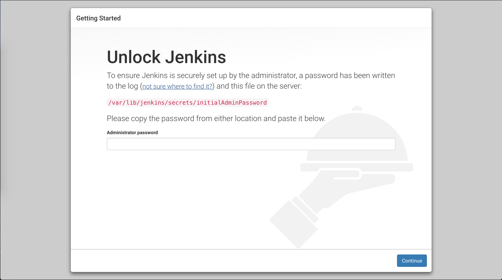

- Show initial admin password

```bash
sudo cat /var/lib/jenkins/secrets/initialAdminPassword
```

Copy the password to console, then click on the _continue_ button.

- Install suggested plugin

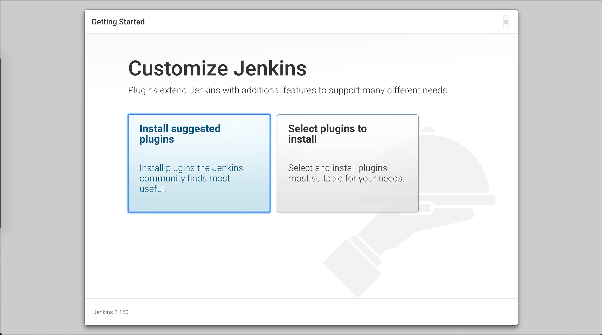

A collection of plugins will be installed after you click on the button on the left.

- Set up Admin username and password, login console

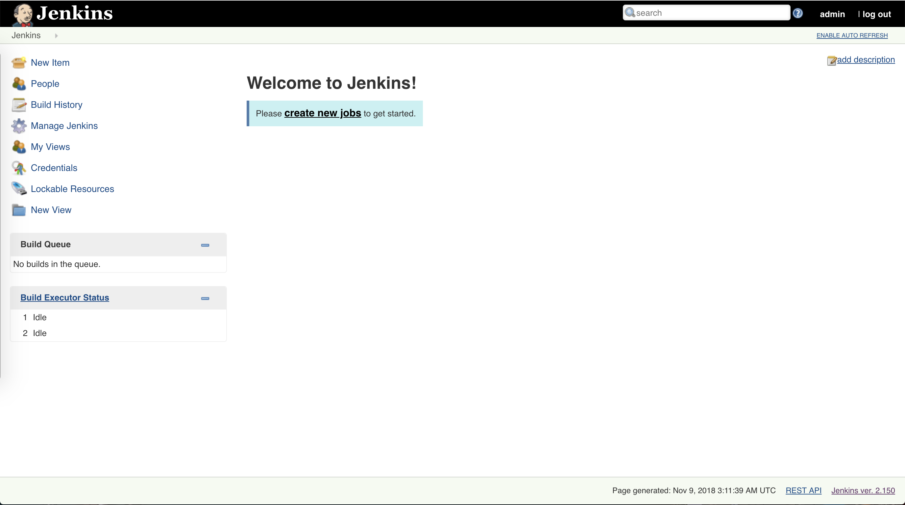

### CI - Hook Jenkins to Git

- Create a new Jenkins job
    - name: _demo_
    - select _Freestyle project_

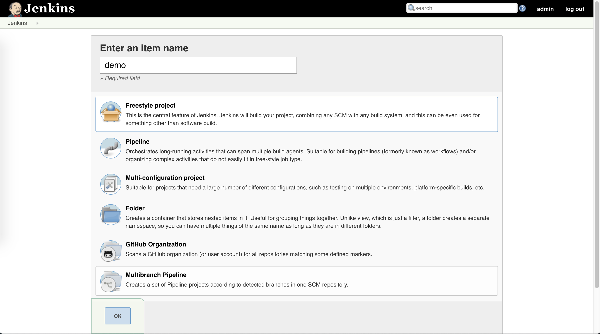

- Link job to the private Git repository

Under _Source Code Management_ tab, select _Git_ and enter repository url
(*username@git\_server\_IP addr:path\_to\_repo*)

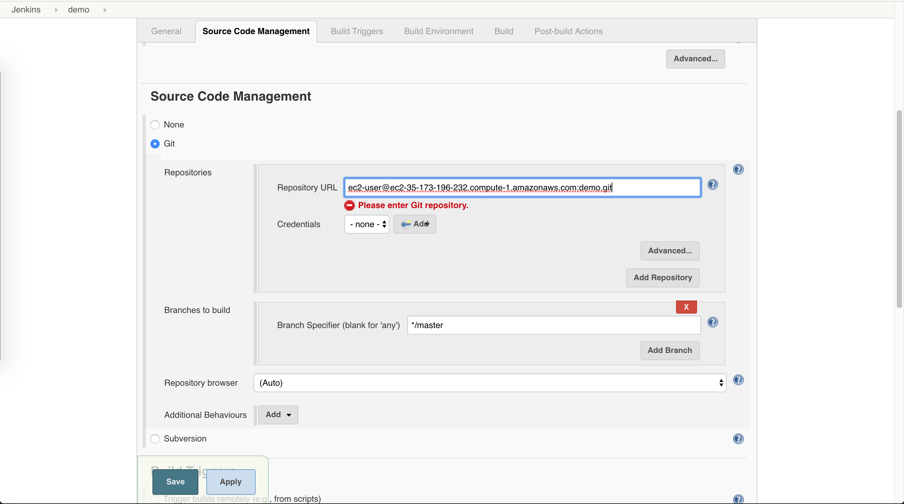

- Add SSH private key of Jenkins server in credential
    - Select _Kind_ as _SSH Username with private key_
    - Select _Enter directly_ for _Private key_

      To show private key, run `cat ~/.ssh/id_rsa`

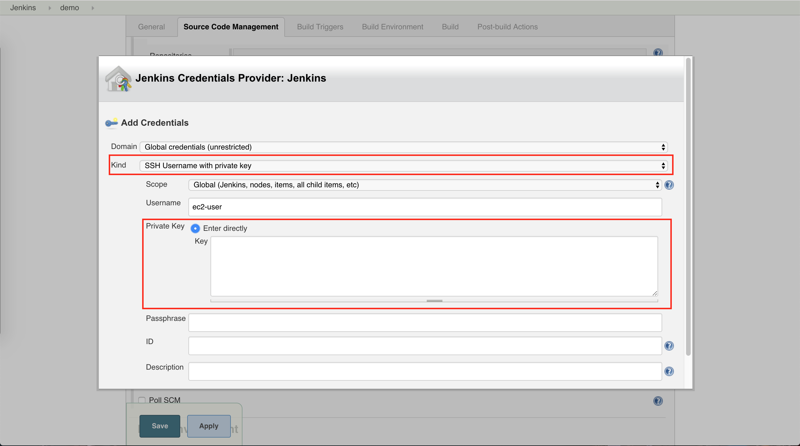

As a Git client, Jenkins Server is able to pull code repository from Git Server now.

- Set up build trigger

Select _Poll SCM_ and leave _Schedule_ blank,

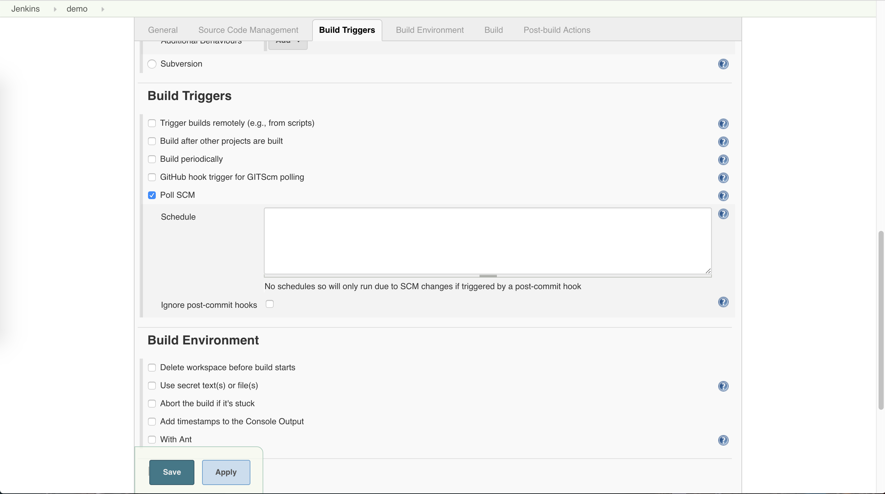

If you would like to trigger a build at a certain time of day or every a few hours, you can set it up
in the _Schedule_ box so that Jenkins Server polls Git Server according to your schedule to check if any update
is available. 

In this demo, a build is only triggered when code is pushed to the Git Server.

- Set up _post-receive_ hook on Git Server

Create _post-receive_ hook in _demo_ repository, which is triggered when Git server receives a commit

```bash
cd ~/demo.git/hooks
touch post-receive
chmod +x post-receive
vim post-receive
```

Write bash script into _post-receive_ hook, which notifies Jenkins of the code push

```bash
#!/bin/sh
curl http://ec2-52-90-247-111.compute-1.amazonaws.com:8080/git/notifyCommit
?url=ec2-user@ec2-35-173-196-232.compute-1.amazonaws.com:demo.git
```

The script makes an HTTP request to the Jenkins Server API, whose url is in format *\<Jenkins Server IP\>:\<Port\>/git/notifyCommit*,
and passes a parameter which indicates the Git repository information.

Once the hook is set up, any code push to the _demo_ repository will trigger a Jenkins API call.

- Test hook by pushing some code to Git server,

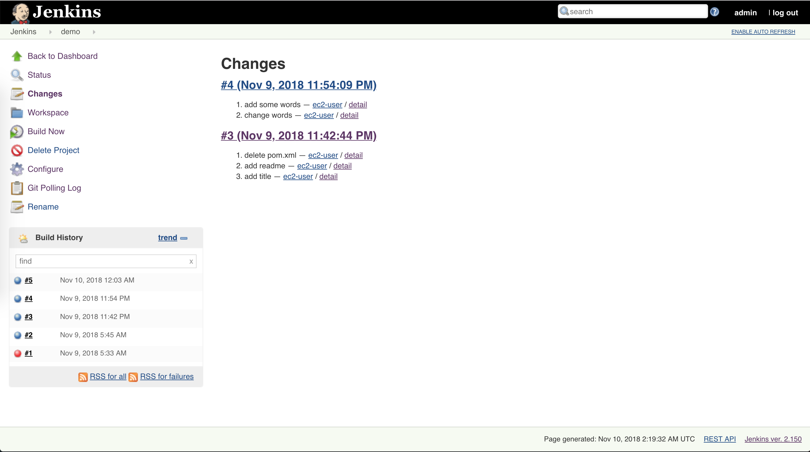

In Jenkins console, the code push is polled by Jenkins and triggers a build thereafter.

### CI - Jenkins Builds Docker Image Upon Dockerfile

- Install Docker CE on Jenkins Server and start Docker service

```bash
sudo yum install docker -y
sudo service docker start
sudo usermod -a -G docker ec2-user
```

- Install *docker-build-step* plugin in Jenkins console

Go to Jenkins plugin manager, select _Available_ tab, search for _docker-build-step_,
and then click on _Install without restart_ button.

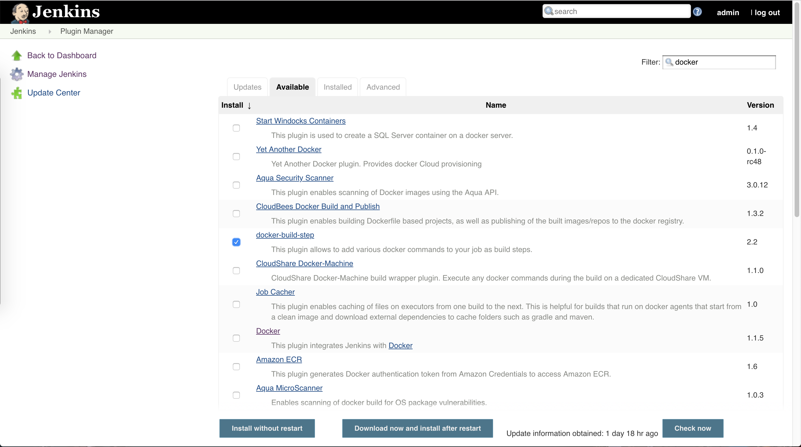

- Enable Docker Remote API

Open the file _/lib/systemd/system/docker.service_, search for _ExecStart_

```bash
vim /lib/systemd/system/docker.service
```

Replace _ExecStart_ value

```bash
ExecStart=/usr/bin/dockerd -H tcp://0.0.0.0:4243 -H unix:///var/run/docker.sock
```

Restart Docker service

```bash
sudo systemctl daemon-reload
sudo service docker restart
```

Test calling API

```bash
curl http://localhost:4243/version
```

If it works, configure Docker URL as _tcp://127.0.0.1:4243_ in system configuration

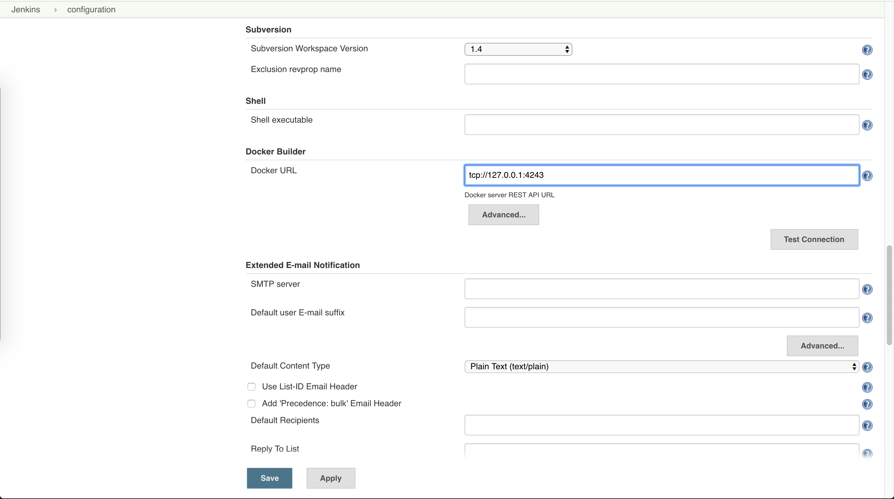

Now Jenkins can trigger Docker build by calling Docker Remote API, which listens on port _4243_.

- Add Docker build step in _Build Environment_ section for job _Demo_
    - Click on _Add build step_ button
    - Select _Execute Docker Command_
    - Select _Create/build image_
    - Set _Build context folder_ to _$WORKSPACE/_
    - Set _Image Tag_ to *$JOB_NAME:v$BUILD_NUMBER*

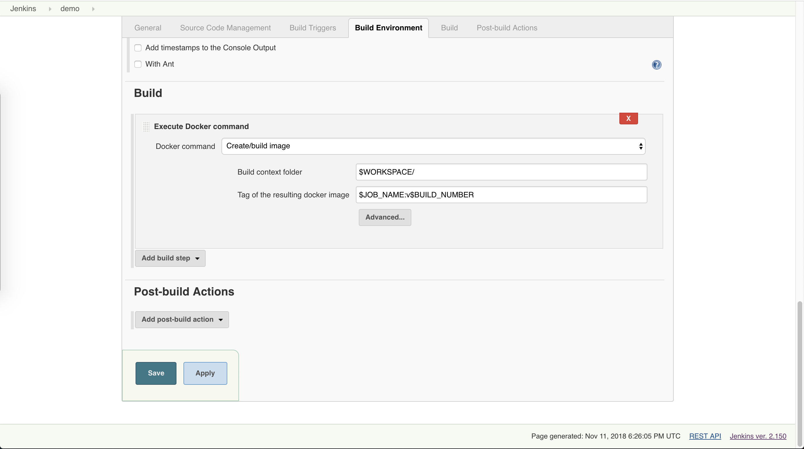

This configuration assumes a _Dockerfile_ sits along the application code that is pulled from Git Server,
builds artifact as a Docker image and conducts tests according to specifications in the _Dockerfile_.
Any error in the _Dockerfile_ will lead to build failure. If the build is successful, a Docker image will
present on Jenkins server with repository name _demo_ ($JOB\_NAME), and tag _v11_ (v$BUILD\_NUMBER).

To verify the build, run command

```bash
docker images
```

- Test by pushing a Dockerfile with app code to Git server, watch Docker image build and run app container

On developer machine, clone _demo_ repository first.

Create an _index.js_ file with content below,

```javascript
var os = require("os");
var hostname = os.hostname();
console.log("hello from " + hostname);
```

Create a Dockerfile

```
FROM alpine
RUN apk update && apk add nodejs
COPY . /app
WORKDIR /app
CMD ["node","index.js"]
```

Commit and push, in a few seconds, Jenkins finishes building Docker image,

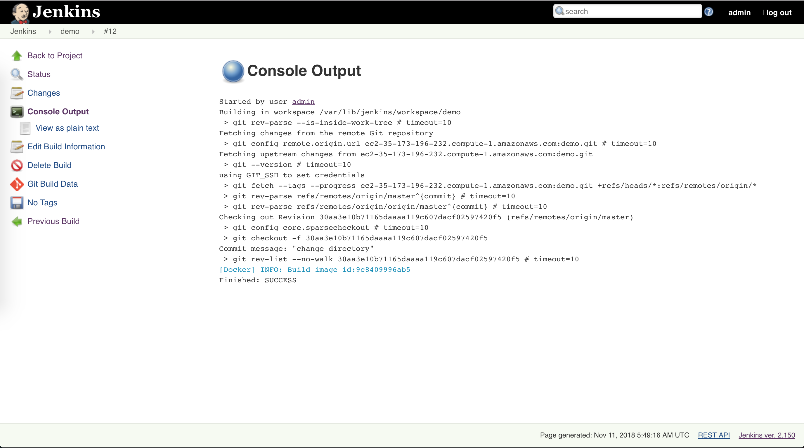

Show images,

```bash
[ec2-user@ip-172-31-41-17 ~]$ docker images
REPOSITORY          TAG                 IMAGE ID            CREATED             SIZE
demo                v12                 9c8409996ab5        3 minutes ago       32.6MB
alpine              latest              196d12cf6ab1        2 months ago        4.41MB
```

Run a container on demo:v12,

```bash
[ec2-user@ip-172-31-41-17 ~]$ docker run 9c84
hello from c487f3634efb
```

### CI - Jenkins Pushes Docker Image to Registry

- Enable _HTTP_ protocol for image push on Jenkins Server

Open the file _/lib/systemd/system/docker.service_, search for _ExecStart_

```bash
vim /lib/systemd/system/docker.service
```

Append _ExecStart_ value with (private Docker Registry IP addr:port)

```bash
--insecure-registry ec2-18-206-231-25.compute-1.amazonaws.com:5000
```

By default, _Registry_ uses _HTTPS_ for image push, to simplify the set up,
configuration as above is needed.

- Add 2 additional Docker build steps

Tag the image and push it to the private Docker Registry

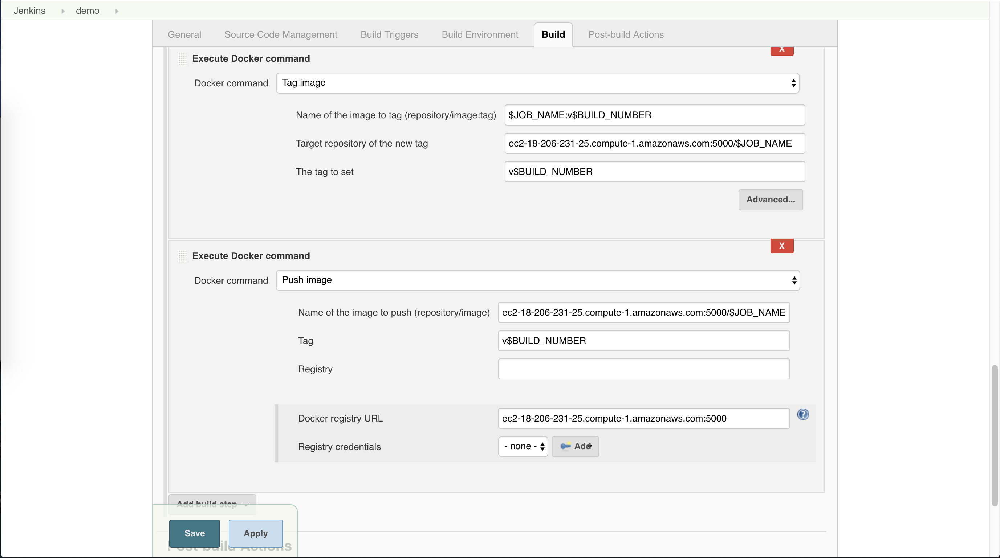

First, add a build step which tags the local image as *\<private Docker Registry IP addr\>:\<Port\>/$JOB_NAME*,
then add another build step which pushes the newly tagged image to private Docker Registry.

- Test by triggering a build and check private Docker Registry

On Jenkins console, it will show the build log with a success message at the end as below,
which indicates the Docker image has been built and pushed to the private Docker Registry.

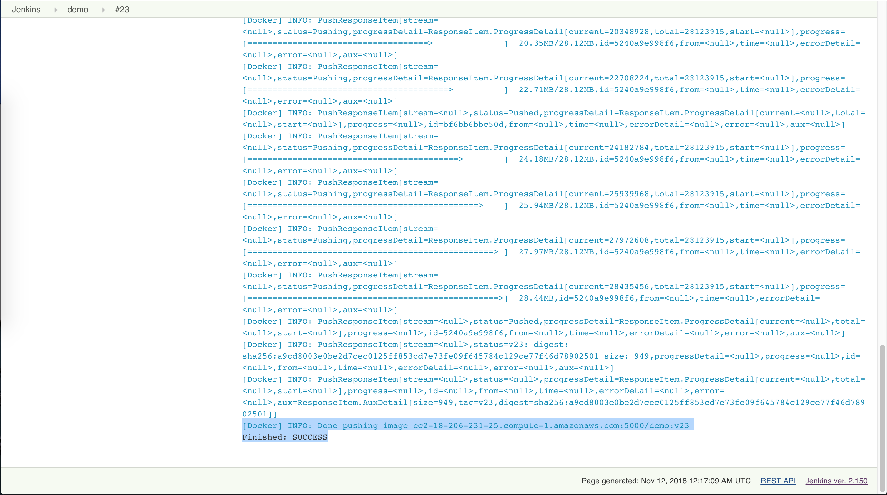

On Docker Registry Server, check the directory that has been mounted to _Registry_ container, 
the image just pushed could be found in

```bash
ls /myregistry/docker/registry/v2
```

or simply call the _Registry_ API,

```bash
curl ec2-18-206-231-25.compute-1.amazonaws.com:5000/v2/_catalog

{"repositories":["demo"]}

curl ec2-18-206-231-25.compute-1.amazonaws.com:5000/v2/demo/tags/list

{"name":"demo","tags":["v15","v16"]}
```